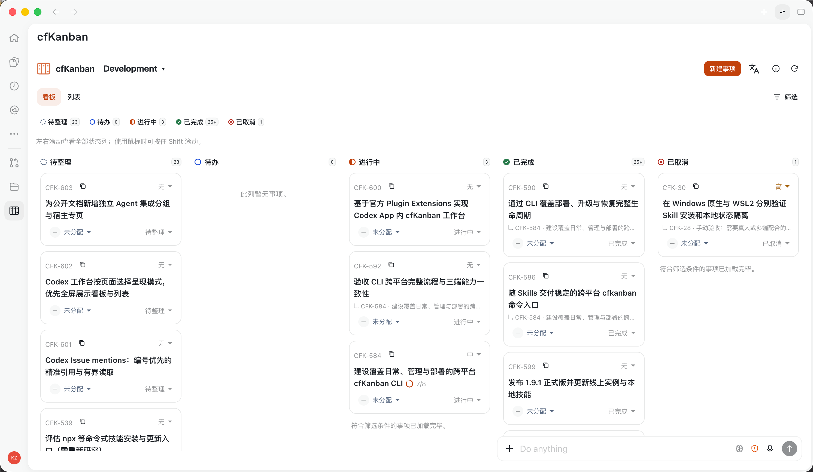
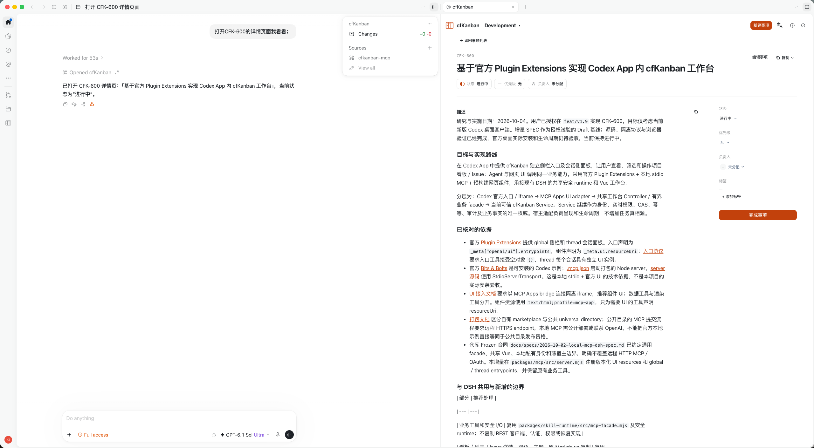
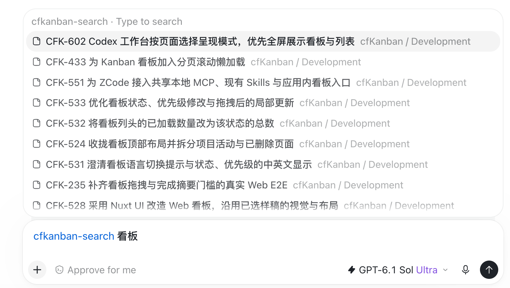

# Codex App

In Codex App, **Skills are the main way to use cfKanban**: tell the Agent what you want to do. The extension adds boards, Issue details and `@` search so you can also browse beside your conversation.

## Installation and checks

For a first installation, give Codex the prompt from the [general installation guide](./general.md). If cfKanban is already installed, ask the Agent to check it:

```text
I installed cfKanban in Codex App. Check that the Skills and local setup are ready,
preserve my identity and Project associations, and tell me whether to reopen Codex.
```

New members also need to [join a Project](../usage/access.md).

## Work with the Agent through Skills

After installation, give the Agent natural-language requests, for example:

```text
Show my unfinished tasks in the current Project, ordered by priority.
Read CFK-123 and explain its goal and current progress.
Set CFK-123 to high priority and add a Comment explaining why.
```

The four Skills cover usage guidance, task collaboration, administration, and installation or deployment; see the [general Agent guide](./general.md). You can ask the Agent to create or edit Issues, add Comments, and record completion. See [Working on tasks](../usage/index.md) for everyday examples.

## Browse and mention Issues with the extension

The extension adds UI features alongside Skills. When your client supports them, open the workbench to browse or make changes yourself, or select an Issue reference in the composer.

### Open a board or Issue details

Open the workbench from the client's cfKanban entry, or ask the Agent:

```text
Open the cfKanban board.
Open the details of CFK-123.
```

[](../../assets/integrations/codex-app-full.png)

*Full-size board; click the image to open the original.*

[](../../assets/integrations/codex-app-sidebar.png)

*Issue details beside a conversation; click the image to open the original.*

Click the Project name at the top to switch Projects, switch between board and list, and click an Issue to open its details. The client controls where the workbench appears; use **Expand workbench** when available. For a browser page, ask: “Open the cfKanban board in a browser.”

### Mention an Issue in a conversation

1. Type `@` in the composer and **click `cfkanban-search` to select it**.
2. After its name token appears, enter `CFK-123`, a number prefix such as `CFK-12` / `12`, or title keywords such as `plugin search`.
3. Click a matching Issue, add a request such as “Summarize this Issue,” and send.

[](../../assets/integrations/codex-search.png)

*Select the search entry before typing a number or title; click the image to open the original.*

Number prefixes need at least two digits and title keywords at least two characters. Bodies and Comments are not searched. Candidates show the identifier, title and Project; after selecting one, ask the Agent to read its contents.

Select the entry first: typing the entire string `@cfkanban-search CFK-123` may leave you in global search. You can also send “Read CFK-123 and summarize it” directly, without using search or the workbench.

## Updates and common questions

To update, ask the Agent:

```text
Update this computer's cfKanban Skills and plugin to the latest stable release,
preserve my identity and Project associations, and tell me whether to reopen Codex.
```

Local updates and [online instance upgrades](../deployment/updates.md) are separate. Updating the plugin does not upgrade the online Service.

- **No search results?** Check the input length. On first use, the Issue list needs preparation; try entering the query again later. If it still returns nothing, ask the Agent to check the connection and Project access.
- **No workbench entry, or the old UI remains after updating?** Ask the Agent to check the local installation and client support. Skills remain the collaboration entry; reconnect or reopen Codex for the UI as instructed.

If a workbench change has an uncertain result, use **Recover** in the original page and confirm the outcome before closing the page or restarting.
