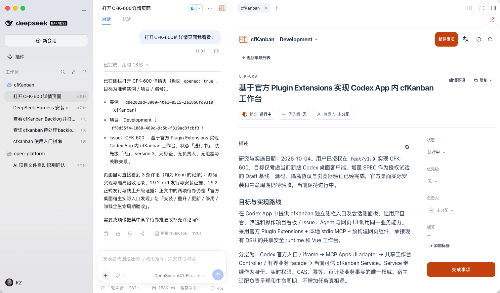

# DeepSeek Harness

The DSH plugin puts cfKanban beside your chat: ask the Agent to open an Issue, then read its details or work on the board without leaving the conversation. It adds Skills, MCP, and the task sidebar in one installation. **Once installed, you do not need to install the Skills or configure MCP separately.** This page covers DSH desktop and Web running on your own computer. The current compatibility baseline is DSH `0.2.0-rc.2`.

## Ask your current Agent to install

```text
Read the official cfKanban installation guide:
https://github.com/breakstring/cfKanban/releases/latest/download/install.md
Install the cfKanban plugin for DeepSeek Harness desktop on this computer.
Use a compatible release containing the DSH plugin, preserve my identity and other plugins, and verify it is available.
Do not deploy or upgrade an online instance.
```

For the Web version, replace “desktop” with “Web.” Their plugin locations are separate; installing in one does not install in the other. Include the exact version when requesting a prerelease.

The Agent prepares the plugin package from the official release and installs it in the DSH version you choose. It gives specific instructions if you need to enable it in Plugins or reopen DSH. If you do not yet have a cfKanban identity, continue with [Joining and signing in](../usage/access.md). Installing the plugin does not join a project.

## Can I install by entering the repository URL in DSH?

**DSH supports online installation sources, but the cfKanban source repository URL is not currently a direct installation source.** DSH accepts Git, npm, or archive URLs. The complete cfKanban plugin currently comes inside the Skills release package, with no separate online plugin package entry point. Neither the repository root nor the Skills ZIP URL is a directly installable DSH plugin.

Use the local file method below or let the Agent handle installation.

If you prefer the desktop UI, first ask the Agent to prepare the verified plugin file:

```text
Prepare the official cfKanban plugin package compatible with my DSH, verify it, and give me its local file path.
I will install it manually in DSH's Plugins page.
```

Open **Plugins → Add plugin**, enter the local `.tgz` path provided by the Agent, select **Install**, then **Enable now**. Restart if DSH asks. You do not need to unpack source code or calculate digests yourself. See the [official DSH plugin UI guide](https://github.com/deepseek-ai/deepseek-harness/blob/dsh-v0.2.0-rc.2/packages/client/ui-plugin-manager/README.md) for supported entry points.

## Open the project sidebar

With a compatible plugin enabled, ask your Agent:

```text
Open CFK-123 in the sidebar.
```

You can also name a project. The Agent checks access, opens the sidebar and confirms it has reached the requested page. If the sidebar capability is unavailable, it explains the limitation without opening a browser instead. Asking to open a view does not install or enable a plugin.

[](../../assets/integrations/dsh-sidebar.png)

*The cfKanban sidebar stays beside the conversation; click the image to open the original. This screenshot illustrates the desktop layout; example tasks, language and available controls can differ in your installation.*

To open it manually:

1. Open your working project directory in DSH.
2. Select the **cfKanban logo** beside the chat panel.
3. If the directory has a project association, the sidebar checks your identity and access, then opens the sole matching project. Choose a target when there are several.

Without an association, select a project manually or ask the Agent to [save a project association](../usage/profile.md) for the directory. An association only helps selection; it does not grant access. The plugin uses the identity on the computer running DSH. Remote or shared multi-user DSH services are outside the sidebar's current support scope.

In the sidebar, select the current project to switch projects, use **Kanban** or **List** to browse tasks, and click a task to read its details. Authorized users can edit priority, status and assignee, add comments, and record completion. **Open full online board** opens the current project or task online. For workspace, member, or Owner management, ask the Agent to open the [management page you need](../administration/index.md). See [Open a board](./webui.md) for the two interfaces.

The DSH Web version also embeds the sidebar through the plugin; you do not need to open a separate local workbench page in your browser.

If a write has an uncertain result, use **Recover** in the original view before closing the sidebar or restarting DSH. Reopening a view does not retry the earlier operation automatically.

## Update or troubleshoot

```text
Update the cfKanban plugin in my current DSH to the latest compatible stable release.
Preserve my identity and other plugins, check that it works, and tell me what needs to restart.
```

If the plugin is missing, check whether you installed it in the desktop or Web version you are using, whether it is enabled, and whether a restart is needed. If the sidebar opens but shows no projects, check [membership and access](../usage/access.md). Reinstalling the plugin does not resolve missing permissions.
